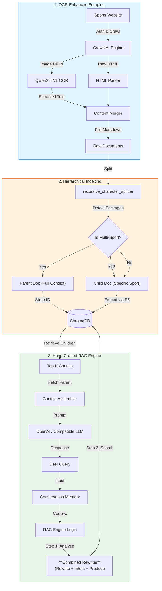

# 📚 Product Catalog Information RAG

This project demonstrates an **Enterprise-Grade RAG Architecture** designed for complex Product Information Systems.

## 💡 The Use Case
Imagine you have a system with **thousands of products**. Each product has its own specific information, pricing, and details.
Instead of forcing users or staff to manually search for each **Product ID** and read through long documentation, a **Chatbot RAG** is the ideal solution to instantly retrieve answers.

### ❌ The Problem
However, simply "feeding" documents to a standard RAG chatbot often fails in this scenario:
1.  **Context Confusion**: If a user asks *"How much is it?"*, the bot doesn't know *which* product they are currently discussing.
2.  **Fragmented Answers**: The bot might find a small text chunk saying *"Includes 5G support"*, but fail to understand *which plan* that feature belongs to, leading to wrong answers.

### ✅ Our Solution (V3 Architecture)
To solve these specific problems, we implemented the **V3 Logic** in this architecture:

1.   **Advanced Query Rewriting**: The system doesn't just search; it *understands*. It rewrites vague questions (e.g., "price?") into precise, product-specific queries (e.g., "price of Pro Plan") before searching.
2.   **Sticky Product Context**: It "remembers" the active product, ensuring follow-up questions ("What about the other one?") are correctly routed to the alternative product's context.
3.   **Parent-Child Retrieval**: When a specific feature is found, the system retrieves the **complete product documentation** (Parent), preventing fragmented answers.

### 🏗️ Architecture Diagram



### 🧠 Deep Dive: The "Context Assembler"
The **Context Assembler** is the core of our V3 strategies. It is not just a concatenation of text; it is an intelligent layer that:
*   **Takes** the *Rewritten Query* (which has the correct product name inserted).
*   **Matches** it with *Parent Documents* (full context) instead of just small fragments.
*   **Assembles** a prompt that tells the LLM: *"The user is asking about [Product A]. Here is the Full Brochure. Answer specifically about Pricing."*
This ensures the LLM has the **Perfect Context** to generate a smooth, accurate answer.

---

## �️ System Components

1.  **Ingestion (`src/ingestion`)**:
    - Splits generic files into chunks.
    - specialized splitting for **Multi-Product Bundles** (Parent) -> Product-Specific Sections (Children).
2.  **Engine (`src/chatbot`)**:
    - **CombinedRewriter**: Manages state (Product/Intent) and rewrites queries.
    - **RAGEngine**: Orchestrates retrieval, using state to filter and fetch Parents.
3.  **Frontend Interface**:
    - Simple chat interface for demonstration.

## 📦 Repository Structure

This repository is a **Reference Implementation** of advanced RAG techniques.

```text
.
├── 📂 data/
│   └── synthetic_raw/       # Reference Dataset (Schema Only)
│   └── processed/           # Structure for Parent-Child relationships
├── 📂 src/ais_rag/          # Core Logic
│   ├── ⚙️ ingestion/
│   │   ├── hierarchy.py     # [CRITICAL] Implements Parent-Child splitting logic
│   │   ├── chunker.py       # Markdown chunking strategy
│   │   └── vector_store.py  # Vector DB Abstraction
│   └── 🧠 chatbot/
│       ├── rewriter.py      # [CRITICAL] V3 Combined Analysis (Rewrites + Intent)
│       ├── engine.py        # [CRITICAL] State Management & Retrieval Orchestration
│       ├── memory.py        # Conversation Summary implementation
│       └── llm_client.py    # LLM Interface
└── 📄 requirements.txt      # Technology Stack
```

## 🧠 Key Engineering Patterns

### 1. Unified Analysis Architecture (`rewriter.py`)
Instead of chaining multiple LLM calls (latency heavy), we use a single purpose-built prompt to:
*   **Rewrite** the user query.
*   **Detect Product Category** context (e.g., "Enterprise Software").
*   **Identify Intent** (e.g., "Pricing", "Compatibility").
*   **Return JSON** for deterministic routing.

### 2. Sticky Context Management (`engine.py`)
The system implements a **Sticky State** separate from conversation history.
*   *User*: "Tell me about the Pro Plan." -> **State Locked**: `Product='Pro Plan'`
*   *User*: "What is the price?" -> **Rewriter** sees state -> **Rewrite**: "What is the price of [Pro Plan]?"

### 3. Hierarchical Retrieval (`hierarchy.py`)
**Problem**: Vector search retrieves small fragments (Children) that lack context.
**Solution**:
1.  **Index**: Small, specific chunks (e.g., "4K Support included").
2.  **Retrieve**: When a chunk is hit, the system fetches the **Parent Document** (Full Product Brochure).
3.  **Generate**: The LLM receives the full context, ensuring it knows that "Enterprise Bundle" includes specific features from multiple sub-products.

---
*This architecture is a reference implementation for complex RAG systems.*

## 🧪 Verified Scenarios

This architecture is verified to handle:
1.  **Context-Aware Price Check**:
    *   *User*: "How much is the Pro Plan?" (Context Locks to `Pro Plan`)
    *   *User*: "Does it include API access?" (System knows 'it' = Pro Plan)
2.  **Cross-Product Inquiry**:
    *   *User*: "What about the Enterprise Bundle?" (Context Switches, retrieval targets Enterprise parent doc)
3.  **Feature Lookup**:
    *   *User*: "Which plan has 24/7 support?" (Retrieves parent documents to check feature lists across products)
