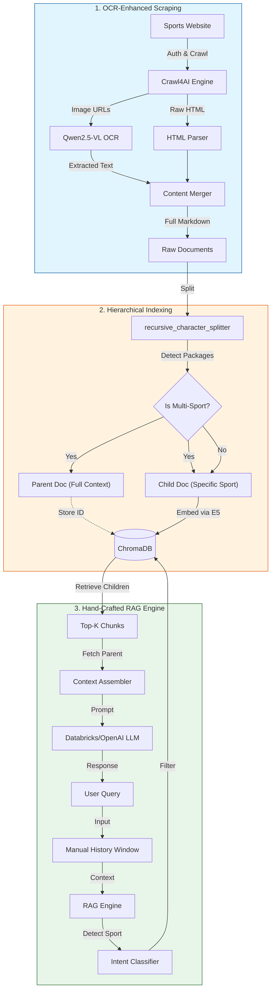

# 🏆 Adaptive Sports RAG (Technical Showcase)

> **Role**: AI Engineer (End-to-End Implementation)
> **Tech Stack**: Python, Crawl4AI, Qwen2.5-VL (OCR), ChromaDB, Databricks Serving
> **Key Concept**: Hierarchical Retrieval without LangChain

## 📖 Overview & Problem Solved
**The Challenge**: Standard RAG pipelines fail when scraping complex internal sports dashboards. The data is often locked in **promotional images** (banners with prices) or stored in mixed **"Super Bundles"** (multi-sport packages) where a simple chunking strategy loses the context of which sport belongs to which package.

**The Solution**: A custom-engineered RAG pipeline that:
1.  **"Reads" Images**: Uses a Vision-Language Model (Qwen2.5-VL) to OCR promotional banners during scraping.
2.  **Preserves Context**: Implements a **Parent-Child Indexing** strategy. We search small chunks (Children) for precision but feed the full pricing table (Parent) to the LLM for accuracy.
3.  **Removes Bloat**: Replaces heavy frameworks (LangChain) with a lightweight, hand-crafted `ConversationMemory` and `RetrievalEngine` for full control over the context window.

---

## 🏗️ System Architecture

## 🏗️ System Architecture



## 📂 Project Structure Explained

```text
.
├── 🐳 Dockerfile               # Production container definition
├── 🐙 docker-compose.yml       # Orchestration (App + Monitoring)
├── 📦 pyproject.toml           # Modern Python dependency management
├── 🚀 app.py                   # Main Entry Point (Gradio UI)
├── 🧪 tests/                   # Unit Verification Suite
│   └── test_core.py            # Tests for Memory & Logic
├── 📓 notebooks/               # Jupyter Notebooks for Demo/Analysis
│   └── demo_ingestion.ipynb    # Runnable Pipeline Demo
├── 📂 src/ais_rag/             # Core Application Source Code
│   ├── 🕷️ scraper/             # Data Acquisition Module
│   │   ├── crawler.py          # Crawl4AI Logic
│   │   └── ocr_engine.py       # Qwen2.5-VL Integration
│   ├── ⚙️ ingestion/           # Data Processing Module
│   │   ├── hierarchy.py        # Parent-Child Logic (Key Feature)
│   │   └── vector_store.py     # ChromaDB Management
│   └── 🧠 chatbot/             # RAG Intelligence Module
│       ├── engine.py           # Retrieval & Generation Chain
│       ├── memory.py           # Manual Sliding Window Memory
│       └── llm_client.py       # Databricks/OpenAI Wrapper
└── 📄 requirements.txt         # Legacy dependency list
```

*(Note: Actual data pathways include strict firewall traversals, represented here conceptually)*

## 🔐 Use of Proprietary Data (Why Mock Data?) -- **[READ THIS]**

This repository contains the **complete, functional source code** of the system used in production. However, because the actual scraping targets are internal dashboards and the data is proprietary:

1.  **Mock Data**: I have included a `data/raw` folder with **mock markdown files** (simulating the structure of real EPL/NBA packages).
2.  **Verified Logic**: You can run `notebooks/demo_ingestion.ipynb` to see the logic work perfectly on this mock data.
3.  **Real Code**: The `src/` folder contains the exact robust logic used in production (including the sliding-window memory and recursive character matching).

## 🚀 How to Run (Portfolio Demo)

1.  **Install**:
    ```bash
    pip install -r requirements.txt
    ```

2.  **Verify Ingestion**:
    Run `python verify_ingestion.py`.
    *Output*: You will see it Chunk -> Index -> Store in ChromaDB.

3.  **Run Chatbot**:
    ```bash
    # Open the UI to test Retrieval (Uses Mock Data)
    export OPENAI_API_KEY="your-key-here"
    python app.py
    ```

## 🧠 Key Engineering Decisions

### Why Hand-Crafted Memory?
Instead of `LangChain.ConversationBufferMemory`, I implemented a custom sliding window class (`src/ais_rag/chatbot/memory.py`).
**Advantage**: Precise control over token counts and ability to "inject" system prompts (like "You are a Sport Assistant") *after* history truncation but *before* the new query, ensuring instructions never get lost in long contexts.

### Why Parent-Child Indexing?
Users ask "How much is the Sport Package?". A simple chunk might just say "Price: $199" without context.
**My Strategy**:
- **Chunk**: "Price: $199" (Good for search match)
- **Retrieved**: The FULL document containing "NBA + EPL + Golf" (Good for answer generation).
- *See `src/ais_rag/ingestion/hierarchy.py` for implementation.*
